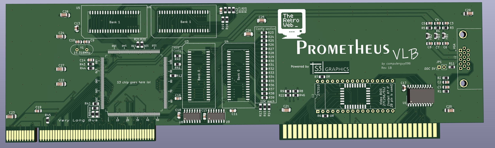

# Prometheus VLB - an affordable way to get a fast video card for your VLB systems

This is an open source video card, designed to be used in systems with a VLB slot, like a 486 class machine. It's designed around the S3 Trio64V+ video chip (86C765), which can be found in many PCI video cards, as wel as separately.
As a bonus, this particular chip allows for a very easy implementation for the VL bus, with almost no support components required, even the RAMDAC is built into the chip.
The card was designed from scratch, using only the official datasheet and photos of an STB Powergraph 64 for a few visual references.

## Features

- S3 Trio64V+ (86C765) or S3 ViRGE (86C325)[^1] video chip, with a powerful and very compatible 2D core, perfect for most DOS games
- up to 2MB of fast page or EDO memory, with clearance for SOJ sockets
- configurable address range, with 32MB, 64MB and 1024MB as options
- simple design, built in RAMDAC, only requires a few extra parts
- fully configurable registers with pull-downs, allowing the tuning of various parameters like memory timings, etc.
- flexible EEPROM implementation, allows DIP28, DIP32, as well as PLCC32 footprints
- common VGA connector placement, allows reusability for many of the old metallic brackets
- small PCB, which does not extend below the card edge in the front, so it will not collide with keyboard controller chips on some boards

## Documentation

Trio64V+ datasheet can be read [here](docs/DB018-A_Trio64V+_Integrated_Graphics_Video_Accelerator_Jul95.pdf), and the ViRGE datasheet [here](docs/DB019-B_ViRGE_Integrated_3D_Accelerator_Aug1996.pdf).

## FAQ

**Q: Is this for sale? Where can I buy one?**

> Nope, it's not for sale, and I do not have any intentions to sell them. However, I am an advocate for open source hardware so the design is fully public (the gerbers, the schematic, everything, all provided under GPLv3) so you can build your own card freely.

**Q: What parts do I need to build a card?**

> There is a [CSV BOM](kicad/virge-vlb.csv) included, as well as an [interactive HTML BOM](kicad/bom/ibom.html), with all the parts and their quantities listed. The main thing to acquire is the S3 chip itself, which can be salvaged from PCI cards or bought as NOS trays. 
**Be careful with the chip model, only 86C765 and 86C325 are fully pin compatible and will work!**

**Q: What about the video BIOS?**

> The binary is from an STB Powergraph64 (closest card to this one in terms of design) and it is available in the repository right [here](VBIOS.BIN)

**Q: Where can i find the gerber files?**

> At `/kicad/gerber` on this repo.

## Footnotes

[^1]: S3 ViRGE support is experimental in VLB mode, since there are no drivers available for it.

